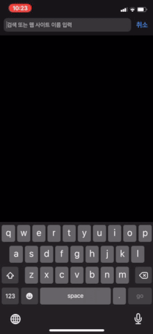
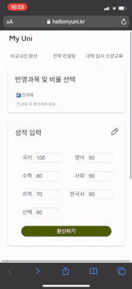

# &#128519; MyUni : [hellomyuni.kr](https://www.hellomyuni.kr)

### 복잡한 `검정고시 전형` 정보를 정리해서 해당 전형 지원자에게 도움을 주는 프로젝트 입니다.
 

### 검정고시 점수를 대학별로 환산해서 제공합니다.
#### 전년도 입시 성적을 함께 제공함으로써 현재 위치를 가늠할 수 있습니다. 
 

  

 
 
 

### 대학 입시에 대한 1:1 상담과 강의를 제공하고 있습니다. 
#### 정보를 얻기 힘든 검정고시 수시 전형에 대해 더 잘 알 수 있습니다. 

 

 

 
 
 

## 기술 스택  🧰

     

 
 
 

## 멋쟁이 Collaborator 🦄
| NAME | WORK & INTRO|
| ----- | ----- |
| 강동인 | Backend |
| <b>강예은</b> | <b>기획, 팀장, 총괄</b> |
| 김재원 | Backend, Infra |
| 김혜린 | Front End |
| 이종욱 | Front End |
| 이예지 | Designer |

 
 

## 연락처 📧
### 팀장 : imaginemyuni@gmail.com
#### MyUni에 함께 참여하고 싶은 분의 연락을 기다립니다~