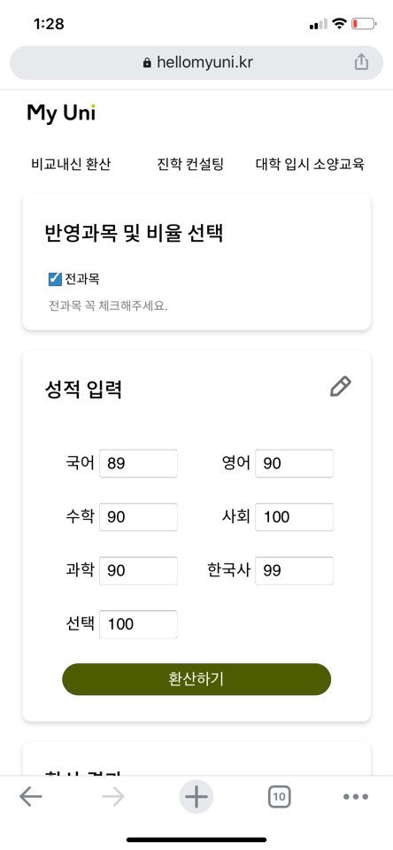
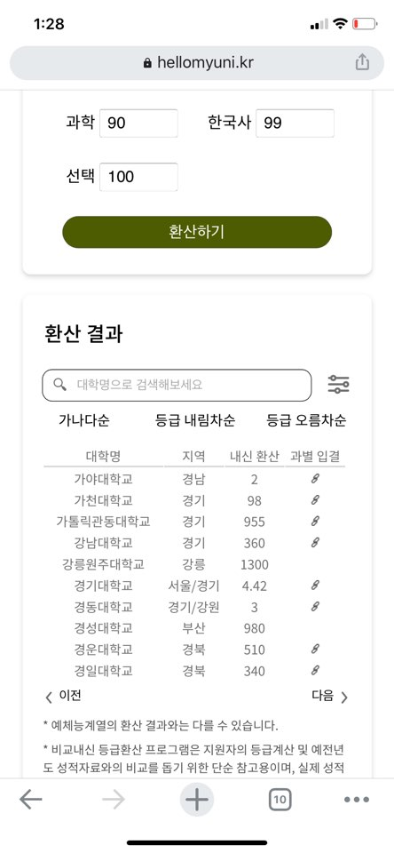
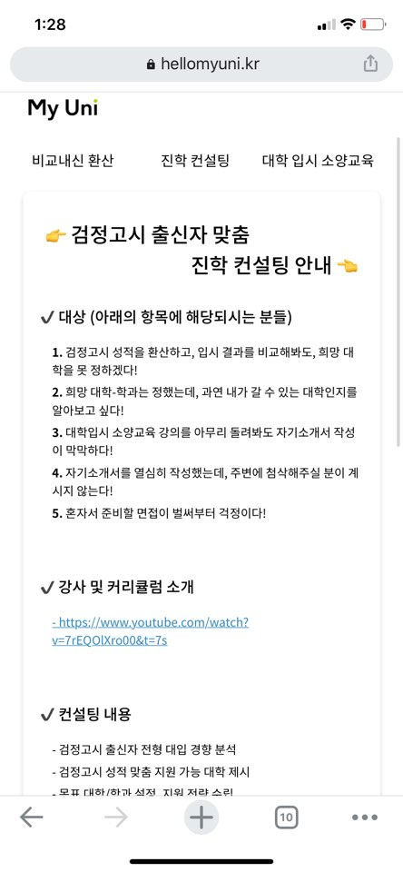
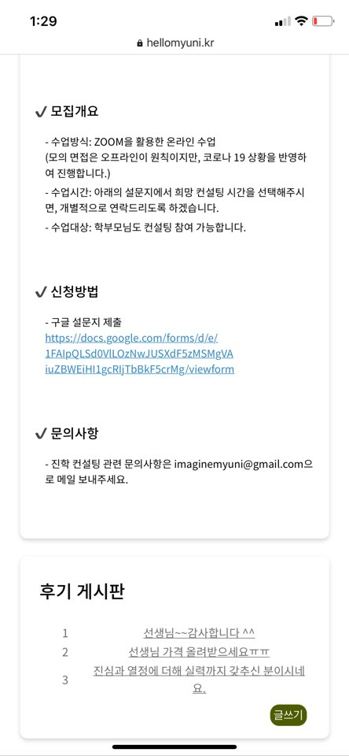
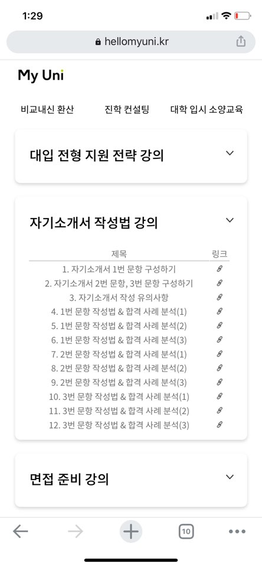
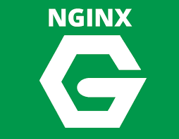

# &#128519; MyUni : [hellomyuni.kr](https://www.hellomyuni.kr)

### 복잡한 `검정고시 전형` 정보를 정리해서 해당 전형 지원자에게 도움을 주는 프로젝트 입니다.
 

    

 

### <b>검정고시 점수 대학별 환산</b>
### <b>입시 상담</b>
### <b> 대학 입시에 관한 강의</b> 를 제공하고 있습니다.

 
 
 

## 기술 스택  🧰

     

 
 
 

## 멋쟁이 Collaborator 🦄
| NAME | WORK & INTRO|
| ----- | ----- |
| 강동인 | Backend |
| <b>강예은</b> | <b>기획, 팀장, 총괄</b> |
| 김재원 | Backend, Infra |
| 김혜린 | Front End |
| 이종욱 | Front End |
| 이예지 | Designer |

 
 

## 연락처 📧
### 팀장 : imaginemyuni@gmail.com
#### 관심있는 분의 참여를 기다립니다~
